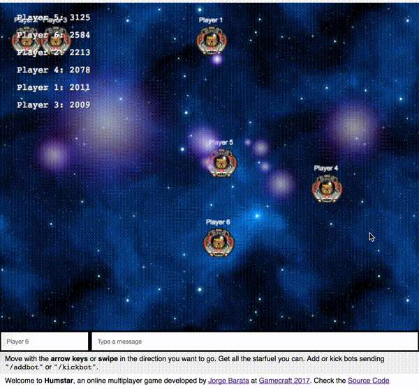

# Humstar — GameCraft 2017

Welcome to **Humstar**, an online multiplayer game developed by [Jorge Barata](https://twitter.com/neuralhacker) at [Gamecraft 2017](https://www.gamecraft.it/).

You can play here: [humstar2017.herokuapp.com](https://humstar2017.herokuapp.com).

Move with the **arrow keys** or **swipe** in the direction you want to go. Get all the starfuel you can. Add or kick bots sending `/addbot` or `/kickbot`.



# Installation

```
yarn
node index.js
```

Then open `localhost:3000`.

You can also spin up a free Heroku dyno to test it out:

[](https://heroku.com/deploy?template=https://github.com/jorgebg/gamecraft-2017)


# Tech stack

- Frontend:
  - [Phaser 2](https://phaser.io/)
  - [nippleJS](https://github.com/yoannmoinet/nipplejs)
- Backend:
  - [Node.js V6](https://nodejs.org)
  - [Express](https://expressjs.com/)
  - [socket.io](https://socket.io/)
  - [p2.js](https://github.com/schteppe/p2.js)

It also used pieces of the following projects:

- [socket.io chat-example](https://github.com/socketio/chat-example)
- [Phaser 2 examples](https://github.com/photonstorm/phaser-examples)
